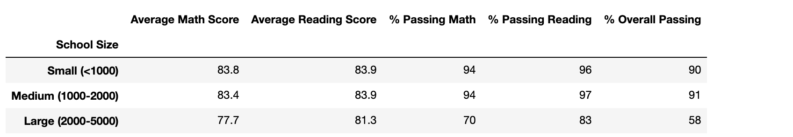

# School_District_Analysis

## Overview of Project

### Purpose

The purpose of this project is to comparing the results of school district analysis before and after replacing the reading and math scores for the ninth grade at Thomas High school with NaNs.

## Results

- How is the district summary affected?
  
  Before replacing ninth grade score:

  
  
  After replacing ninth grade score:
  
  
  
  From the figures above, we can see that after replacing ninth grade score at Thomas High School to NaNs only decreases average math score by 0.1. Except average math score, average reading score and three passing rate remain unchanged.

- How is the school summary affected?

  Before:
  
  
  
  After:
  
  
  
  From the figures above, we can see that after replacing ninth grade score at Thomas High School, average math score, % passing math, % passing reading and % overall passing are all slightly decreased. However, average reading score is increased by 0.05.

- How does replacing the ninth graders’ math and reading scores affect Thomas High School’s performance relative to the other schools?

  Before:

  
  
  After:
  
  
  
  Comparing the two figures above, we can see that the performance of Thomas High School relative to the other schools is not affected (remains at second place)  since the changing of score is so small after replacing ninth grade score to NaN.
  

- How does replacing the ninth-grade scores affect the following:

    - Math and reading scores by grade

    Before (math score):

    
    
    After (math score):
    
    
    
    By comparing the figures above, we can clearly see that for Thomas High School, the math scores for 10th, 11th, and 12th grade do not change at all except the math score for 9th grade changes to NaNs.
    
    Before (reading score):
    
    
    
    After (reading score):
    
    
    
    By comparing the figures above, we can clearly see that for Thomas High School, the reading scores for 10th, 11th, and 12th grade do not change at all except the reading score for 9th grade changes to NaNs.
    
    - Scores by school spending
    
    Before and After:
    
    
    
    Scores by school spending does not change after replacing ninth grade score.
    
    - Scores by school size
    
    Before and After:
    
    
    
    Scores by school size does not change after replacing ninth grade score.
    
    - Scores by school type
    
    Before and After:
    
    
    
    Scores by school type does not change after replacing ninth grade score.

## Summary

Four major changes in the updated school district analysis after reading and math scores for the ninth grade at Thomas High School have been replaced with NaNs:

1. Average math score in district summary was decreased by 0.1.
2. Average math score, % passing math, % passing reading and % overall passing were all slightly decreased at Thomas High School.
3. Average reading score was increased by 0.05 at Thomas High School.
4. The ninth grade math and reading score were changed to NaN in the figures of Math and Reading score by grade.
